$$ 
E_x(x, y, z) = \frac{\sigma}{4\pi \varepsilon_0} \left[ \sinh^{-1}\left(\frac{y + b}{\sqrt{(x + a)^2 + z^2}}\right)

\sinh^{-1}\left(\frac{y - b}{\sqrt{(x + a)^2 + z^2}}\right)
\sinh^{-1}\left(\frac{y + b}{\sqrt{(x - a)^2 + z^2}}\right)
\sinh^{-1}\left(\frac{y - b}{\sqrt{(x - a)^2 + z^2}}\right) \right] 
$$

# **Représentation d'un champ électrique**

Ce projet universitaire à été réalisé en deuxième année de licence à l'Université de Versailles St Quentin par Jean-Baptiste Serinet et Maël Berthet dans le but de construire un outil de représentation du champ électrique engendré par une surface donnée, ainsi que leurs combinaisons dans des condensateurs.

___

Tout le code associé à ce projet se trouve dans le dossier projet.ipynb
**Attention** ! Afin de vous assurer de pouvoir faire tourner chaque programme, nous vous recommandons d'éxécuter la commande suivante dans votre terminal: **"pip install -r requirements.txt"**

---

## **Arborescence**

Le dossier du projet est décomposé en 5 fichiers:

- **"projet.ipynb"**: Ce fichier contient toutes les fonctions du projet. Il est découpé en niveaux - le niveau 1 étant le plus bas (ie indépendant des autres). On y retrouve également une zone de test et une section vierge pour exécuter les fonctions désirées.

- **"structure_du_projet.ipynb"**: Dans ce fichier vous retrouverez en détail toutes les fonctions présentes dans le projet, leur description et un exemple d'utilisation. Les tests sur les fonctions y sont également présentés.

- **"requirements.txt"**: Contient les modules nécessaires au fonctionnement du projet.

- **"README.md"**

On retrouve également un dossier "img" qui contient tous les plots des tests que nous avons effectués.

---

## **Objectifs**

L'objectif principal de ce projet est de pouvoir modéliser un condensateur réel uniformément chargé dont les armatures sont aux choix : des disques, des plans ou des cylindres.

Nous avons choisi d'utiliser des maillages pour répondre à la problématique. Cette approche nous permet alors de discrétiser les intégrales présentent dans le calcul du champ et du potentiel électrique de la façon suivante:

$$
\mathbf{E}(\mathbf{M}) = \int_{\text{distribution}} \frac{\sigma dS}{4\pi\varepsilon_0} \frac{\mathbf{PM}}{\|\mathbf{PM}\|^3} \approx \sum_{i=1}^{N} \frac{dq}{4\pi\varepsilon_0} \frac{\mathbf{P}_i\mathbf{M}}{\|\mathbf{P}_i\mathbf{M}\|^3}
$$

$$
V(\mathbf{M}) = \int_{\text{distribution}} \frac{\sigma dS}{4\pi\varepsilon_0\|\mathbf{PM}\|} \approx \sum_{i=1}^{N} \frac{dq}{4\pi\varepsilon_0\|\mathbf{P}_i\mathbf{M}\|}
$$

où:

- **N** : Nombre de point du maillage de la distribution.

- **M** : Le point de calcul.

- **dq** : Charge portée par un point de la distribution.

En nous intéressant aux **condensateurs**, nous allons aussi devoir nous intéresser aux **conducteurs**, c'est pourquoi il sera également possible d'observer le champ et/ou le potentiel créé(s) dans l'espace par ces derniers. De fait nous essayerons par la même occasion de déterminer les limites spatiales de l'approximation de la plaque infinie, sur une plaque et sur un disque.

**Pour résumé les objectifs:**

- Initialiser un maillage.

- Charger uniformément un maillage de distribution.

- Calculer le potentiel et le champ électrique créés par une distribution en un point.

- Calculer le potentiel et le champ électrique créés par une distribution en tout point d'un maillage de calcul.

- Tester les grandeurs en fonction d'un jeu de paramètres.

- Afficher:

    - un maillage.

    - les équipotentielles.

    - le champ créé par la distribution.

    - le potentiel créé par la distribution.

**Optionnels:**

- Tracer l'erreur de l'approximation numérique par rapport à l'approximation de la plaque infinie.

- Créer des distributions quelconques.

- Charger non uniformément une distribution.

---

## **Fonctionnalités**

Nous présentons dans cette section les fonctions, chacune répartie dans un niveau allant de 1 à ???, leur utilité, leur fonctionnement et donnons un exemple d'utilisation.

### **Niveau 1**

#### **La classe "Surface"**

Le **niveau 1** est dédié à la classe "**Surface**". Elle a pour utilité de simplifier la création de maillage et de réduire **considérablement** le nombre d'argument de certaines fonctions. On peut par exemple penser à la fonction "**calculer_charge_dS**" du **niveau 4** qui passe de **8 arguments à seulement 2** !

##### - **Initialisation**

La méthode `__init__` permet d'initialiser une instance de la classe **Surface** avec les paramètres suivants :

- `parametrage` : une fonction définissant la paramétrisation de la surface.
- `domaine_u` : un tuple `(float, float, (optionnel : bool))` représentant l'intervalle pour le paramètre \(u\) et un booléen pour indiquer si l'intervalle est fermé : True pour l'ouvrir, False par défaut.
- `domaine_v` : un tuple `(float, float, (optionnel : bool))` représentant l'intervalle pour le paramètre \(v\) et un booléen pour indiquer si l'intervalle est fermé : True pour l'ouvrir, False par défaut.
- `densite` : un entier représentant la densité de la surface. Il y a $densité^2$ points dans la surface.
- `*args` : des arguments supplémentaires passés à la fonction de paramétrisation.

**Signature** : 

```python
def __init__(self, parametrage: callable, domaine_u: tuple[float, float, bool], domaine_v: tuple[float, float, bool], densite: int, *args) -> "Surface"
```

Pour rappel, une surface $(S)$ est décrite par 2 variables qu'on appelera $u$ et $v$. Ainsi, si $M \in (S)$ alors 

$$
M(u,v) = \begin{pmatrix} 
x(u,v) \\ 
y(u,v) \\ 
z(u,v) 
\end{pmatrix}
$$

Un exemple de paramétrage serait celui de la sphère qui pourrait se décrire de cette façon:

$$ 
M(\phi,\theta) = \begin{pmatrix}
Rsin(\phi)cos(\theta)\\
Rsin(\phi)sin(\theta) \\
Rcos(\phi)
\end{pmatrix}
$$

Pour $\phi \in [0,\pi]$ et $\theta \in [0,2\pi[$

Ce qui donnerait en python:

```python
import numpy as np

def sphere(theta, phi, R=1):              
    x = R * np.sin(phi) * np.cos(theta)
    y = R * np.sin(phi) * np.sin(theta)
    z = R * np.cos(phi)
    return x, y, z
```

où $\theta \in \left[0,2\pi\right]$ et $\phi \in \left[0,\pi\right]$.

**Exemple d'instance**:

```python
- surface = Surface(sphere, (0,2*np.pi,True), (0,np.pi), 100, 2)
```
Cette ligne permet de créer une sphère **de rayon 2** contenant **10 000 points**. Le **True** dans le premier domaine permet d'éviter de prendre deux fois le même demi-cercle car le points tel que $\theta = 0$ et $\theta = 2\pi$ sont les mêmes.

##### - **Afficher_definition**

La méthode `afficher_definition` permet **d'afficher la fonction paramétrage**. Si par exemple le paramétrage de la surface était celui ci-dessus, alors elle afficherait:

```python
def sphere(u, v, R=1):
    theta = 2 * np.pi * u         
    phi = np.pi * v               
    x = R * np.sin(phi) * np.cos(theta)
    y = R * np.sin(phi) * np.sin(theta)
    z = R * np.cos(phi)
    return x, y, z
```

Elle ne prend pas d'argument et ne renvoie rien si ce n'est afficher le paramétrage.

**Signature**:
```python
def afficher_definition(self) -> None
```

**Exemple d'utilisation**:

En reprenant les notations:

```python
- print(surface.afficher_definition())
```
affiche:

```python
def sphere(u, v, R=1):
    theta = 2 * np.pi * u         
    phi = np.pi * v               
    x = R * np.sin(phi) * np.cos(theta)
    y = R * np.sin(phi) * np.sin(theta)
    z = R * np.cos(phi)
    return x, y, z
```

##### - **Calculer_dS**

La méthode `calculer_dS` permet de calculer **l'aire infinitésimale associée à chaque point** de la surface. Comme la répartition de point **n'est pas forcément uniforme** sur la surface, elle permet de donner le même poids, notamment lors du calcule du champ, à chaque zone de la surface. On le remarque bien sur une sphère, surface dont les poles sont plus denses:

<p align="center">
  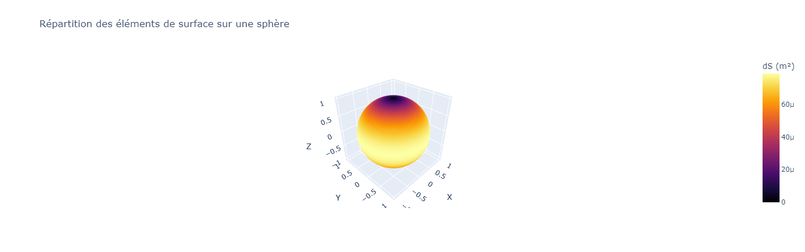
</p>

Elle ne prend pas d'argument et renvoie un tableau 1D contenant autant de valeurs que de points sur la surface. Chaque valeur représente l'élément d'aire associée au point correspondant.

Pour calculer cette aire infinitésimale, nous utilisons la formule $||\mathbf{dS}|| = ||\mathbf{n}||dudv$ où $\mathbf{n}$ est le vecteur unitaire normal à la surface. Il se calcule de la manière suivante: 

$$ \mathbf{n} = \frac{\partial\mathbf{M}}{\partial u} \times \frac{\partial{\mathbf{M}}}{\partial v}$$

On approxime les dérivées par des taux d'accroissements, ainsi:

$$\frac{\partial\mathbf{M}}{\partial u} \approx \frac{\mathbf{M}(u + du, v) - \mathbf{M}(u, v)}{du}$$
$$\frac{\partial\mathbf{M}}{\partial v} \approx \frac{\mathbf{M}(u, v + dv) - \mathbf{M}(u, v)}{dv}$$

où $du = \frac{u_{max} - u_{min}}{densité}$ le pas selon $u$ et $dv = \frac{v_{max} - v_{min}}{densité}$ le pas selon $v$.

**Signature**:

```python
def calculer_dS(self) -> np.ndarray
```

**Exemple d'utilisation**:

En reprenant les notations précédentes:

```python
- print(surface.calculer_dS())
```

##### - **Calculer_aire()**

La méthode `calculer_aire` permet **d'estimer l'aire de la surface**. Elle renvoie la somme de toutes les aires infinitésimales portées par chaque point. L'approximation est **d'autant plus fine que la densité est élevée**. Par exemple, voici le graph de l'erreur d'approximation pour un disque de rayon 1 en fonction de la densité:

<p align="center">
  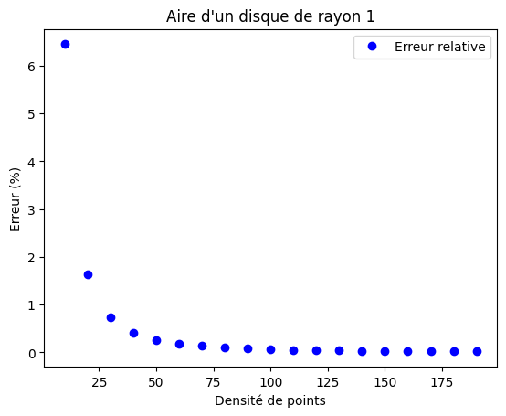
</p>

Elle ne prend pas d'argument et renvoie une approximation de l'aire de la surface.

**Signature**:

```python
def calculer_aire(self) -> float
```

**Exemple d'utilisation**:

En reprenant les notations précédentes:

```python
- print(surface.calculer_aire())
```

---

### **Niveau 2**

#### **La classe "Maillage"**

Le **niveau 2** est dédié à la classe "Maillage". Elle a également pour but de **simplifier** la manipulation des distributions et de **réduire considérablement** le nombre d'arguments des fonctions.

##### - **Initialisation**

La méthode `__init__` permet de créer une instance de la classe "**Maillage**" en prenant les arguments suivants:

- `X` : Un np.ndarray contenant toutes les coordonnées selon x des points du Maillage.

- `Y` : Un np.ndarray contenant toutes les coordonnées selon y des points du Maillage.

- `Z` : Un np.ndarray contenant toutes les coordonnées selon z des points du Maillage.

- `surface` : C'est une liste de surface, n'en mettre qu'une seule au aucune lors de l'initialisation.

**Signature**:

```python
def __init__(self,X : np.ndarray = None, Y : np.ndarray = None, Z : np.ndarray = None, surface : list[Surface] = None) -> "Maillage"
```

**Exemple d'instance**:

En reprenant les notations du **Niveau 1** on peut très bien créer un maillage comme ceci:

```python
- maillage = Maillage(X = np.array([0,1]), Y = np.array([2,3]), Z = np.array([4,5]))
```

qui contient **les points $(0,2,4)$ et $(1,3,5)$**.

Mais on peut aussi l'initialiser comme suivant:

```python
- maillage = Maillage(surface = [surface])
```

qui contient **tous les points de la surface**.

Ou aussi comme cela:

```python
- maillage = Maillage(X = np.array([0,1]), surface = surface)
```

qui contient tous les points de la surface.

Ou encore comme ceci:

```python
- maillage = Maillage(X = np.array([0,1]), Y = np.array([2,3]), Z = np.array([4,5]), surface = surface)
```

qui contient **les points $(0,2,4)$ et $(1,3,5)$**.

##### - **__add__**

Il est possible d'**additionner** deux maillages. L'addition renvoie un **nouveau maillage** contenant les points des deux anciens maillages. Les tableaux X,Y,Z et surface sont définis par la **concaténation** deux à deux respectivement des anciens tableaux.

##### - **__rmul__**

Il est possible de "**multiplier**" un maillage par un scalaire. Cela renvoie un **nouveau maillage** contenant les mêmes points dont les coordonnées ont été **multipliées par le scalaire** ie : 

$$\lambda \in \mathbb{R}, \forall M \in Maillage, M = \begin{pmatrix}
\lambda x \\
\lambda y \\
\lambda z
\end{pmatrix}$$

##### - **__get_item__**

Il est possible de **récupérer un point du maillage** grâce à son indice. Pour ce faire, (en reprenant les notations) on peut écrire:

```python
- print(maillage[i])
```

##### - **__eq__**

Il est possible de tester si deux maillages sont **égaux**. On définit l'égalité si et seulement si les 3 tableaux X,Y,Z des deux maillages **sont égaux selon numpy**.

##### - **Translate**

La méthode `translate` permet comme son nom l'indique permet de **translater** tout le maillage. Elle prend comme arguments:

- `dl` : C'est un tuple de trois float représentant dans l'ordre le déplacement selon x, y puis z.

**Signature**

```python 
def translate(self, dl : tuple[float]) -> "Maillage"
```

Si $\mathbf{dl} = \begin{pmatrix}
dx \\
dy \\
dz
\end{pmatrix}$ alors la méthode renvoie un maillage tel que, $\forall M \in Maillage, M = \begin{pmatrix}
x + dx \\
y + dy \\
z + dz
\end{pmatrix}$.

**Exemple d'utilisation**

```python 
- maillage = maillage.translate((2,0.5,-1))
```

##### - **Rotate**

La méthode `rotate` permet de faire **tourner** le maillage. Elle prend en arguments:

- `axes` : C'est une liste de **string**. **L'ordre compte** car les matrices de rotation ne sont pas commutatives ! La string **"z"** décrit une rotation selon z, de même pour **"x"** et **"y"**.

- `angles` : C'est une liste de float contenant dans l'ordre les angles liés aux rotations.

**Signature**

```python 
def rotate(self, axes : list[str], angles : list[float]) -> "Maillage"
```

La méthode utilise des matrice de rotation, en 3D ce sont les suivantes:

$$R_x(\theta) =
\begin{bmatrix}
1 & 0 & 0 \\
0 & \cos\theta & -\sin\theta \\
0 & \sin\theta & \cos\theta
\end{bmatrix}$$

$$R_y(\theta) =
\begin{bmatrix}
\cos\theta & 0 & \sin\theta \\
0 & 1 & 0 \\
-\sin\theta & 0 & \cos\theta
\end{bmatrix}$$

$$R_z(\theta) =
\begin{bmatrix}
\cos\theta & -\sin\theta & 0 \\
\sin\theta & \cos\theta & 0 \\
0 & 0 & 1
\end{bmatrix}$$

où $\theta$ représente l'angle de rotation et $R_x$ la matrice de rotation autours de x, idem pour y et z.

**Exemple d'utilisation**:

Pour effectuer une rotation de $\frac{\pi}{2}$ autours de $z$ puis de $\pi$ autours de $x$:

```python
- maillage = maillage.rotate(["z","x"],[np.pi/2,np.pi])
```

##### - **Calculer_aire**

La méthode `calculer_aire` permet de calculer l'aire du maillage, cette méthode ne marche que si le maillage contient au moins une surface et renvoie la somme des aires des surfaces composant le maillage. Elle ne prend pas d'argument.

**Signature**:

```python
def calculer_aire(self) -> float
```

##### - **Afficher_3D_plotly**

La méthode `afficher_3D_plotly` permet d'afficher dans une figure **plotly** le maillage. Elle ne prend pas d'argument et ne renvoie rien.

**Signature**:

```python
def afficher_3D_plotly(self) -> None
```

##### - **Afficher_3D_matplotlib** 

La méthode `afficher_3D_matplotlib` permet d'afficher une figure **matplotlib** le maillage. Elle ne prend pas d'argument et ne renvoie rien.

**Signature**:

```python
def afficher_3D_matplotlib(self) -> None
```

##### - **Sum**

La fonction `sum` renvoie la somme d'autant de maillage que pris en argument. Elle renvoie un nouveau maillage contenant tous les points. Argument:

- `M` : C'est une liste de maillages à additionner.

**Signature**

```python 
def sum(*M : list[Maillage]) -> Maillage
```

**Exemple d'utilisation**

En reprenant les notations précédentes:

```python
- maillage_somme = sum(*[Maillage(surface = Surface(sphere, (0,1,True), (0,1), 10, rayon)) for rayon in range(1,11)])
```

qui renvoie un maillage contenant 10 sphères contenant chacune 100 points de rayon 1 à 10.

---

### **Niveau 3**

#### - **Creer_distribution**

Le **niveau 3** est dédiée à la fonction `creer_distribution` qui a pour but de simplifier la création de distribution. Elle prend en les **mêmes arguments que la méthode d'initialisation d'une surface**:

- `parametrage` : une fonction définissant la paramétrisation de la surface.
- `domaine_u` : un tuple `(float, float, (optionnel : bool))` représentant l'intervalle pour le paramètre \(u\) et un booléen pour indiquer si l'intervalle est fermé : True pour l'ouvrir, False par défaut.
- `domaine_v` : un tuple `(float, float, (optionnel : bool))` représentant l'intervalle pour le paramètre \(v\) et un booléen pour indiquer si l'intervalle est fermé : True pour l'ouvrir, False par défaut.
- `densite` : un entier représentant la densité de la surface. Il y a $densité^2$ points dans la surface.
- `*args` : des arguments supplémentaires passés à la fonction de paramétrisation.

Et renvoie un maillage créé à partir de la surface.

**Signature**:

```python
def creer_distribution(parametrage : callable, domaine_u : tuple[float], domaine_v : tuple[float], densite : int, *args) -> Maillage
```

**Exemple d'utilisation**:

En reprenant les notations précédentes:

```python
- maillage = creer_distribution(sphere, (0,1,True), (0,1), 10, 1)
```

et on peut donc par exemple réduire l'exemple précédent pour la fonction sum de la façon suivante:

```python
- maillage_somme = sum(*[creer_distribution(sphere, (0,1,True), (0,1), 10, rayon) for rayon in range(1,11)])
```

--- 

### **Niveau 4**

Les fonctions suivantes sont dédiées au **calcul de la distribution de charge sur une surface ou un maillage**.

#### - **calcule_charge_dS**

La fonction `calcule_charge_dS` permet de **calculer la distribution de charge sur une surface donnée**. Elle prend en argument:

- `surface` : Une instance de la classe `Surface` représentant la surface sur laquelle la charge est distribuée.
- `distribution_charge` : Un tuple contenant deux éléments :
  - La charge totale à distribuer sur la surface.
  - Une fonction `f` qui calcule la distribution de charge (si `f` est `None`, la charge est uniformément répartie sur la surface).

La fonction renvoie un **tableau contenant la distribution de charge sur la surface**, calculée pour chaque point de la surface. Cette valeur est pondérée par le poids donné par la fonction de répartition et par l'aire infinitésimale du point.

**Signature**:

```python
def calcule_charge_dS(surface : Surface, distribution_charge) -> np.ndarray
```

**Exemple d'utilisation**:

En reprenant les notations précédentes:

```python
- charge = calculer_charge_dS(surface, (1e-10, lambda u,v : np.cos(u))) #Charge non uniforme
- charge = calculer_charge_dS(surface, (1e-10, None)) #Charge  uniforme
```

#### - **calcule_charge**

La fonction `calcule_charge` **étend le concept de calcul de distribution de charge à un maillage constitué de plusieurs surfaces**. Cette fonction permet de calculer la distribution de charge sur l’ensemble du maillage en tenant compte de l’aire de chaque surface. Elle prend en arguments:

- `maillage` : Une instance de la classe `Maillage` représentant le maillage contenant plusieurs surfaces.
- `distribution_charge` : Un tuple contenant deux éléments :
  - La charge totale à distribuer sur l’ensemble du maillage.
  - Une fonction `f` qui calcule la distribution de charge (si `f` est `None`, la charge est uniformément répartie sur le maillage).

La fonction renvoie un tableau contenant la **distribution de charge sur le maillage pour chaque point du maillage**. Elle distribue la charge à chaque surface en fonction de son aire.

**Signature**:

```python
def calcule_charge(maillage : Maillage, distribution_charge) -> np.ndarray
```

**Exemple d'utilisation**:

En reprenant les notations précédentes:

```python 
- charge = calculer_charge(maillage, (1e-10, None)) #uniforme
- charge = calculer_charge(maillage, (1e-10, lambda u,v : np.cos(u))) #non uniforme
```

--- 

### **Niveau 5** 

#### - **calcule_champ**

La fonction `calcule_champ` **calcule le champ électrique en chaque point d’un maillage donné**, en tenant compte de la distribution de charge sur un autre maillage. Elle utilise la loi de Coulomb pour déterminer la contribution au champ électrique de chaque élément de charge à chaque point du maillage cible. Elle prend en arguments:

- `distribution` : Une instance de la classe `Maillage` représentant la distribution de charge. Ce maillage contient les informations nécessaires pour déterminer la répartition de la charge.
- `maillage` : Une instance de la classe `Maillage` représentant le maillage sur lequel le champ électrique doit être calculé.
- `distribution_charge` : Un tuple contenant deux éléments :
  - La charge totale à distribuer.
  - Une fonction `f` qui calcule la distribution de charge (si `f` est `None`, la charge est uniformément répartie sur la surface).
- `filtre` : Un paramètre optionnel (de type booléen) qui permet d’appliquer un filtre pour éviter les singularités numériques. Si `filtre` est `True`, les distances très faibles sont remplacées par une valeur arbitraire élevée pour éviter la division par zéro et neutraliser la valeur.

La fonction renvoie un **tableau 2D contenant le champ électrique calculé sur le maillage**. Les lignes représentent les composantes du champ électrique en x, y et z, et les colonnes représentent les points du maillage.

**Signature**:

```python 
def calcule_champ(distribution: Maillage, maillage: Maillage, distribution_charge, filtre : bool = False) -> np.ndarray
```

**Exemple d'utilisation**:

En reprenant les notations précédentes:

```python
- plan_positif = creer_distribution(plan, (-2,2), (-2,2), 100, 0) 
- maillage_calcule = sum(*[creer_distribution(plan, (-2,2), (-2,2), 5, 0.8 + 0.7*i) for i in range(-1,2)])
- C_positif = calcule_champ(plan_positif, maillage_calcule, (1e-10, None),True)
```

##### **Tests**

Nous avons décidé de tester notre fonction sur différentes distributions connues comme:

- le disque
- la sphère 
- le cylindre
- le plan

##### - **Le disque**:

Pour rappel, la formule théorique du champ électrique généré par un disque (dans le plan xoy) de densité surfacique $\sigma$ est :

$$\mathbf{E}(z) = \frac{\sigma z}{2 \varepsilon_0} \left( \frac{1}{|z|} - \frac{1}{\sqrt{z^2 + R^2}} \right)\mathbf{\hat{z}}$$

et il est approximé par :

$$\mathbf{E}(z) \approx ±\frac{\sigma}{2 \varepsilon_0}\mathbf{\hat{z}}$$

quand on se situe suffisamment proche du disque.

Nous sommes donc sensés retrouver ces résultats avec notre fonction. Commençons lorsqu'on se situe "**loin**" du disque (cf. figure ci-dessous):

<p align="center">
  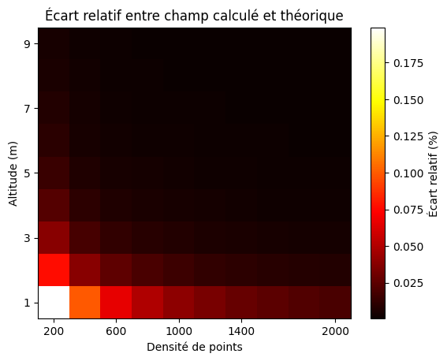
</p>

On observe sur l'**axe des ordonnée l'altitude relative au disque** et sur l'**axe des abscisses la densité** liée au disque. **Chacune des valeurs représente le pourcentage d'erreur** entre notre calcule et la valeur théorique. Voici un tableau nous permettant d'avoir une meilleur idée:

| Densité ↓ / Altitude → (m) | 1.000 | 2.000 | 3.000 | 4.000 | 5.000 | 6.000 | 7.000 | 8.000 | 9.000 |
|---|---|---|---|---|---|---|---|---|---|
| 200                        | 0.1991 | 0.0767 | 0.0380 | 0.0223 | 0.0145 | 0.0102 | 0.0076 | 0.0058 | 0.0046 |
| 400                        | 0.0993 | 0.0383 | 0.0190 | 0.0111 | 0.0073 | 0.0051 | 0.0038 | 0.0029 | 0.0023 |
| 600                        | 0.0662 | 0.0255 | 0.0126 | 0.0074 | 0.0048 | 0.0034 | 0.0025 | 0.0019 | 0.0015 |
| 800                        | 0.0496 | 0.0191 | 0.0095 | 0.0055 | 0.0036 | 0.0025 | 0.0019 | 0.0014 | 0.0011 |
| 1000                       | 0.0397 | 0.0153 | 0.0076 | 0.0044 | 0.0029 | 0.0020 | 0.0015 | 0.0012 | 0.0009 |
| 1200                       | 0.0331 | 0.0127 | 0.0063 | 0.0037 | 0.0024 | 0.0017 | 0.0013 | 0.0010 | 0.0008 |
| 1400                       | 0.0283 | 0.0109 | 0.0054 | 0.0032 | 0.0021 | 0.0015 | 0.0011 | 0.0008 | 0.0007 |
| 1600                       | 0.0248 | 0.0096 | 0.0047 | 0.0028 | 0.0018 | 0.0013 | 0.0009 | 0.0007 | 0.0006 |
| 1800                       | 0.0220 | 0.0085 | 0.0042 | 0.0025 | 0.0016 | 0.0011 | 0.0008 | 0.0006 | 0.0005 |
| 2000                       | 0.0198 | 0.0076 | 0.0038 | 0.0022 | 0.0014 | 0.0010 | 0.0008 | 0.0006 | 0.0005 |

On remarque qu'en moyenne, cette erreur est très faible ce qui nous encourage à croire que notre fonction **marche correctement**. De plus, **plus l'altitude et la densité sont élevées, meilleure est l'estimation** ce qui est cohérent.

Regardons ce qui se passe "**près**" du disque maintenant:

<p align="center">
  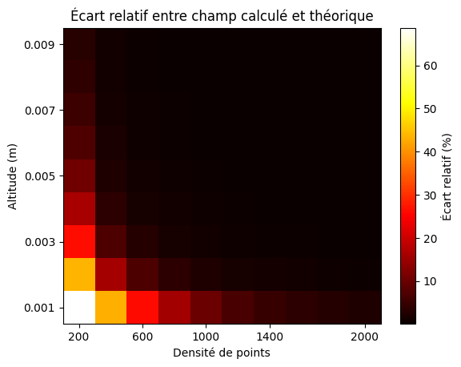
</p>

Avec toujours les **mêmes axes et grandeurs**. Voici le tableau:

| Densité ↓ / Altitude → (m) | 0.001  | 0.002  | 0.003  | 0.004  | 0.005  | 0.006  | 0.007  | 0.008  | 0.009  |
|-----------------------------|--------|--------|--------|--------|--------|--------|--------|--------|--------|
| 200                         | 68.71  | 43.53  | 26.56  | 16.37  | 10.55  | 7.24   | 5.28   | 4.07   | 3.26   |
| 400                         | 43.24  | 16.05  | 6.95   | 3.79   | 2.45   | 1.75   | 1.34   | 1.08   | 0.91   |
| 600                         | 26.13  | 6.85   | 2.91   | 1.66   | 1.12   | 0.82   | 0.65   | 0.53   | 0.46   |
| 800                         | 15.89  | 3.65   | 1.62   | 0.96   | 0.65   | 0.49   | 0.39   | 0.33   | 0.29   |
| 1000                        | 10.07  | 2.29   | 1.05   | 0.63   | 0.44   | 0.33   | 0.27   | 0.23   | 0.20   |
| 1200                        | 6.76   | 1.58   | 0.74   | 0.45   | 0.32   | 0.25   | 0.20   | 0.17   | 0.16   |
| 1400                        | 4.80   | 1.16   | 0.55   | 0.34   | 0.24   | 0.19   | 0.16   | 0.14   | 0.12   |
| 1600                        | 3.59   | 0.89   | 0.43   | 0.27   | 0.19   | 0.15   | 0.13   | 0.11   | 0.10   |
| 1800                        | 2.79   | 0.71   | 0.34   | 0.22   | 0.16   | 0.13   | 0.11   | 0.10   | 0.09   |
| 2000                        | 2.23   | 0.58   | 0.28   | 0.18   | 0.13   | 0.11   | 0.09   | 0.08   | 0.08   |

On remarque cette fois-ci que **plus l'on se rapproche et plus la densité joue un rôle important** dans la cohérence du calcule. C'est encore une fois normale puisque proche, la **discrétisation** du maillage commence à jouer un rôle important, c'est pourquoi en densifiant davantage, on **réduit**, ou plutôt, **repousse** le problème.

##### - **La sphère**:

On rappel que le champ à l'extérieur d'une sphère chargée en surface avec une densité $\sigma$ est donné par la formule:

$$\mathbf{E}(r) = \frac{\sigma}{4\pi\varepsilon_0 Sr^2}\mathbf{\hat{r}}$$

où :

- `S`: Surface de la sphère
- `r`: $||\vec{OM}||$ avec O := centre de la sphère.

Ainsi, toujours avec les **mêmes axes et grandeurs, "proche" de la sphère de rayon 1m**:

<p align="center">
  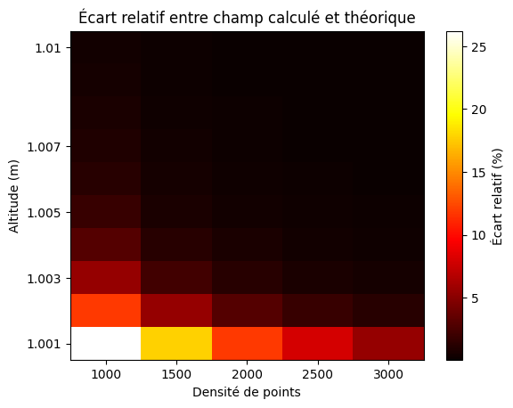
</p>

Avec le tableau de valeur suivant:

| Densité ↓ / Altitude → (m) | 1.001 | 1.002 | 1.003 | 1.004 | 1.005 | 1.006 | 1.007 | 1.008 | 1.009 | 1.010 |
|---|---|---|---|---|---|---|---|---|---|---|
| 1000                       | 26.22224 | 11.86521 | 5.53397 | 2.94808 | 1.80172 | 1.21886 | 0.88330 | 0.67139 | 0.52842 | 0.42717 |
| 1500                       | 17.73730 | 5.51895 | 2.26126 | 1.21299 | 0.76180 | 0.52484 | 0.38423 | 0.29375 | 0.23203 | 0.18802 |
| 2000                       | 11.83437 | 2.93253 | 1.21007 | 0.66524 | 0.42241 | 0.29246 | 0.21467 | 0.16439 | 0.12999 | 0.10541 |
| 2500                       | 7.96714 | 1.78818 | 0.75828 | 0.42147 | 0.26870 | 0.18640 | 0.13697 | 0.10496 | 0.08303 | 0.06735 |
| 3000                       | 5.50398 | 1.20716 | 0.52130 | 0.29118 | 0.18599 | 0.12915 | 0.09496 | 0.07279 | 0.05760 | 0.04673 |

On remarque encore une fois que **plus l'on est proche de la distribution, plus la densité joue un rôle important**. On se place maintenant "**loin**" de la sphère:

<p align="center">
  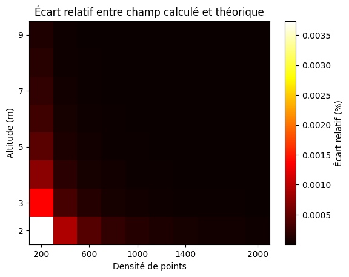
</p>

Avec le tableau de valeur suivant:

| Densité ↓ / Altitude → (m) | 2.000 | 3.000 | 4.000 | 5.000 | 6.000 | 7.000 | 8.000 | 9.000 |
|---|---|---|---|---|---|---|---|---|
| 200                        | 0.00374 | 0.00137 | 0.00072 | 0.00045 | 0.00031 | 0.00022 | 0.00017 | 0.00013 |
| 400                        | 0.00094 | 0.00034 | 0.00018 | 0.00011 | 0.00008 | 0.00006 | 0.00004 | 0.00003 |
| 600                        | 0.00042 | 0.00015 | 0.00008 | 0.00005 | 0.00003 | 0.00003 | 0.00002 | 0.00002 |
| 800                        | 0.00023 | 0.00009 | 0.00005 | 0.00003 | 0.00002 | 0.00001 | 0.00001 | 0.00001 |
| 1000                       | 0.00015 | 0.00006 | 0.00003 | 0.00002 | 0.00001 | 0.00001 | 0.00001 | 0.00001 |
| 1200                       | 0.00010 | 0.00004 | 0.00002 | 0.00001 | 0.00001 | 0.00001 | 0.00000 | 0.00000 |
| 1400                       | 0.00008 | 0.00003 | 0.00002 | 0.00001 | 0.00001 | 0.00000 | 0.00000 | 0.00000 |
| 1600                       | 0.00006 | 0.00002 | 0.00001 | 0.00001 | 0.00000 | 0.00000 | 0.00000 | 0.00000 |
| 1800                       | 0.00005 | 0.00002 | 0.00001 | 0.00001 | 0.00000 | 0.00000 | 0.00000 | 0.00000 |
| 2000                       | 0.00004 | 0.00001 | 0.00001 | 0.00000 | 0.00000 | 0.00000 | 0.00000 | 0.00000 |

On remarque cette fois-ci que le calcule est **très bon**.

##### - **Le cylindre**:

On rappel que le champ généré par le cylindre infini chargé en surface avec la densité $\sigma$ pour $r > R$ est donné par la formule suivante:

$$\mathbf{E}(r) = \frac{\sigma R}{\varepsilon_0 r}\mathbf{\hat{r}}$$

Ainsi, toujours avec les **mêmes axes et grandeurs, "proche" du cylindre de rayon 1m et hauteur 10m**, on se place à une altitude de 5m:

<p align="center">
  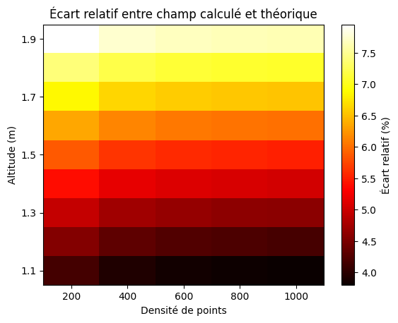
</p>

Avec le tableau de valeur suivant:

| Densité ↓ / Altitude → (m) | 1.100 | 1.200 | 1.300 | 1.400 | 1.500 | 1.600 | 1.700 | 1.800 | 1.900 |
|---|---|---|---|---|---|---|---|---|---|
| 200                        | 4.1624 | 4.5453 | 4.9567 | 5.3952 | 5.8596 | 6.3487 | 6.8613 | 7.3963 | 7.9522 |
| 400                        | 3.9350 | 4.3210 | 4.7353 | 5.1768 | 5.6444 | 6.1369 | 6.6530 | 7.1915 | 7.7512 |
| 600                        | 3.8593 | 4.2462 | 4.6615 | 5.1040 | 5.5727 | 6.0663 | 6.5836 | 7.1233 | 7.6842 |
| 800                        | 3.8215 | 4.2088 | 4.6246 | 5.0676 | 5.5368 | 6.0310 | 6.5488 | 7.0892 | 7.6507 |
| 1000                       | 3.7988 | 4.1864 | 4.6024 | 5.0458 | 5.5153 | 6.0098 | 6.5280 | 7.0687 | 7.6306 |

On voit que **l'erreur augmente plus on s'éloigne ce qui est dû aux bords du cylindre**.

##### - **Le plan**:

Le champ créé par une plaque finie est donné par la formule suivante:

$$
E_x(x, y, z) = 
\frac{\sigma}{4\pi \varepsilon_0}
\left[
\sinh^{-1}\left(\frac{y + b}{\sqrt{(x + a)^2 + z^2}}\right)
- \sinh^{-1}\left(\frac{y - b}{\sqrt{(x + a)^2 + z^2}}\right)
- \sinh^{-1}\left(\frac{y + b}{\sqrt{(x - a)^2 + z^2}}\right)
+ \sinh^{-1}\left(\frac{y - b}{\sqrt{(x - a)^2 + z^2}}\right)
\right]
$$

$$
E_y(x, y, z) = 
\frac{\sigma}{4\pi \varepsilon_0}
\left[
\sinh^{-1}\left(\frac{x + a}{\sqrt{(y + b)^2 + z^2}}\right)
- \sinh^{-1}\left(\frac{x - a}{\sqrt{(y + b)^2 + z^2}}\right)
- \sinh^{-1}\left(\frac{x + a}{\sqrt{(y - b)^2 + z^2}}\right)
+ \sinh^{-1}\left(\frac{x - a}{\sqrt{(y - b)^2 + z^2}}\right)
\right]
$$
$$
E_z(x, y, z) = 
\frac{\sigma}{4\pi \varepsilon_0}
\left[
\arctan\left(
\frac{(y + b)(x + a)}{z\sqrt{(y + b)^2 + z^2 + (x + a)^2}}
\right)
- \arctan\left(
\frac{(y + b)(x - a)}{z\sqrt{(y + b)^2 + z^2 + (x - a)^2}}
\right) \right. \\
\left.
- \arctan\left(
\frac{(y - b)(x + a)}{z\sqrt{(y - b)^2 + z^2 + (x + a)^2}}
\right)
+ \arctan\left(
\frac{(y - b)(x - a)}{z\sqrt{(y - b)^2 + z^2 + (x - a)^2}}
\right)
\right]
$$


où:

- `a`: demi-largeur de la plaque. 
- `b`: demi-longueur de la plaque.

L'expression est compliquée mais quand on plot l'erreur entre ce champ et le notre, on obtient le long du centre de la plaque:

<p align="center">
  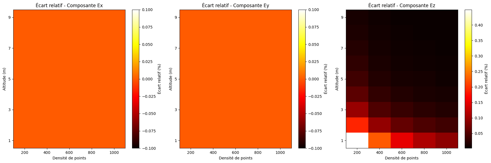
</p>

et au point $M = \begin{pmatrix}
1\\
1\\
x
\end{pmatrix}$:

<p align="center">
  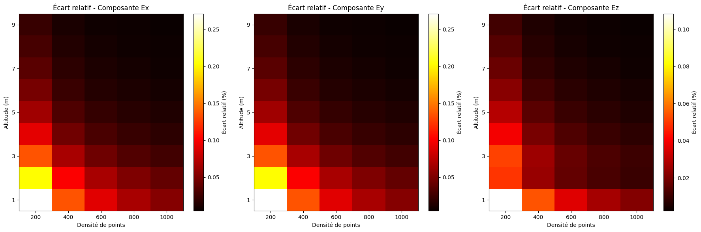
</p>

On se rend compte que le champ calculé est **très bon** et **dépend encore une fois de la densité**.

Pour rappel, approximation de la plaque infinie (pour une plaque dans le plan x0y):

$$\mathbf{E}(z) \approx ±\frac{\sigma}{2 \varepsilon_0}\mathbf{\hat{z}}$$

Nous avons essayé par la même occasion de déterminer les limites spatiales de l'approximation de la plaque infinie, voici les résultats pour une plaque carrée de côté 4m en faisant varier la densité:

<p align="center">
  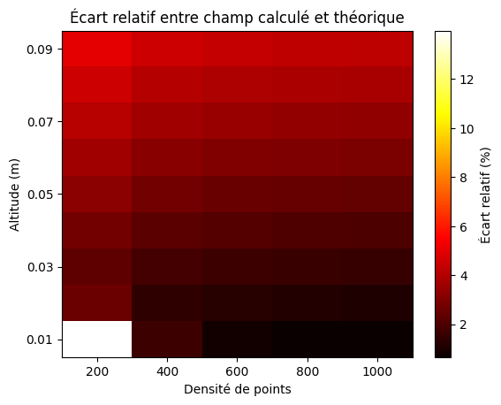
</p>

Avec le tableau ci-dessous: 

| Densité ↓ / Altitude → (m) | 0.010 | 0.020 | 0.030 | 0.040 | 0.050 | 0.060 | 0.070 | 0.080 | 0.090 |
|---|---|---|---|---|---|---|---|---|---|
| 200                        | 13.9744 | 2.5894 | 2.3605 | 2.7724 | 3.2142 | 3.6571 | 4.1000 | 4.5426 | 4.9851 |
| 400                        | 1.6441 | 1.3943 | 1.8396 | 2.2862 | 2.7327 | 3.1791 | 3.6253 | 4.0713 | 4.5171 |
| 600                        | 0.8130 | 1.2288 | 1.6767 | 2.1244 | 2.5720 | 3.0195 | 3.4668 | 3.9140 | 4.3609 |
| 800                        | 0.6997 | 1.1468 | 1.5951 | 2.0434 | 2.4916 | 2.9397 | 3.3875 | 3.8352 | 4.2827 |
| 1000                       | 0.6488 | 1.0975 | 1.5462 | 1.9948 | 2.4434 | 2.8917 | 3.3400 | 3.7880 | 4.2358 |

Les résultats dépendent encore une fois de la densité ce que est dû au fait que plus l'on se rapproche, plus l'on "voit" la maillage, la discrétisation. De plus, plus l'altitude augmente et plus l'erreur est grande ce qui est dû aux bords de la plaque.

On fixe maintenant la densité à 600 et on fait à la fois varier l'altitude et la position sur l'axe (0x):

<p align="center">
  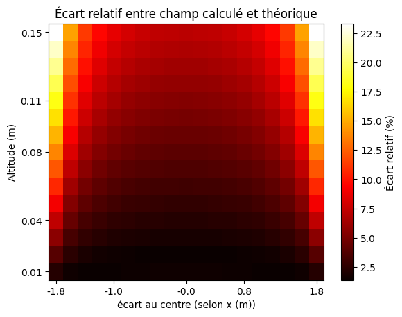
</p>
<p align="center">
  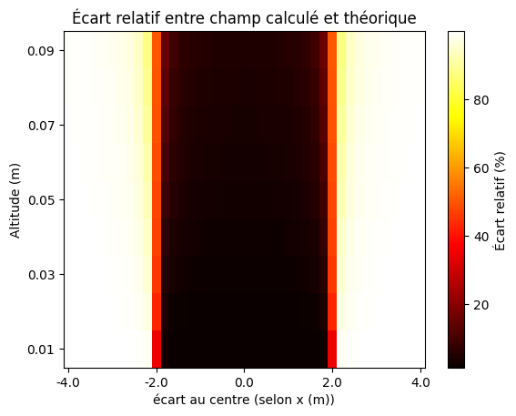
</p>

Avec les tableaux ci-dessous:

figure 2:

| écart au centre (selon x (m)) ↓ / Altitude → (m) | 0.010 | 0.020 | 0.030 | 0.040 | 0.050 | 0.060 | 0.070 | 0.080 | 0.090 |
|---|---|---|---|---|---|---|---|---|---|
| -4.0                       | 99.9426 | 99.8852 | 99.8278 | 99.7704 | 99.7130 | 99.6557 | 99.5984 | 99.5412 | 99.4840 |
| -3.8                       | 99.9303 | 99.8606 | 99.7909 | 99.7213 | 99.6517 | 99.5821 | 99.5126 | 99.4431 | 99.3737 |
| -3.6                       | 99.9140 | 99.8281 | 99.7421 | 99.6563 | 99.5704 | 99.4846 | 99.3989 | 99.3133 | 99.2278 |
| -3.4                       | 99.8919 | 99.7838 | 99.6758 | 99.5678 | 99.4599 | 99.3521 | 99.2444 | 99.1369 | 99.0295 |
| -3.2                       | 99.8607 | 99.7215 | 99.5824 | 99.4433 | 99.3044 | 99.1656 | 99.0271 | 98.8887 | 98.7507 |
| -3.0                       | 99.8148 | 99.6297 | 99.4447 | 99.2599 | 99.0753 | 98.8910 | 98.7071 | 98.5236 | 98.3406 |
| -2.8                       | 99.7426 | 99.4854 | 99.2283 | 98.9717 | 98.7155 | 98.4599 | 98.2051 | 97.9511 | 97.6980 |
| -2.6                       | 99.6171 | 99.2345 | 98.8525 | 98.4713 | 98.0913 | 97.7128 | 97.3360 | 96.9612 | 96.5887 |
| -2.4                       | 99.3565 | 98.7140 | 98.0736 | 97.4362 | 96.8028 | 96.1743 | 95.5517 | 94.9358 | 94.3274 |
| -2.2                       | 98.5448 | 97.0981 | 95.6680 | 94.2623 | 92.8879 | 91.5509 | 90.2566 | 89.0090 | 87.8113 |
| -2.0                       | 34.7775 | 42.6658 | 45.4883 | 46.9881 | 47.9586 | 48.6645 | 49.2192 | 49.6793 | 50.0764 |
| -1.8                       | 2.3000 | 3.9520 | 5.6603 | 7.3474 | 9.0074 | 10.6346 | 12.2244 | 13.7731 | 15.2774 |
| -1.6                       | 1.5943 | 2.4553 | 3.4306 | 4.4032 | 5.3720 | 6.3362 | 7.2948 | 8.2471 | 9.1922 |
| -1.4                       | 1.4174 | 1.9595 | 2.6884 | 3.4167 | 4.1438 | 4.8694 | 5.5933 | 6.3151 | 7.0347 |
| -1.2                       | 1.3874 | 1.7203 | 2.3296 | 2.9391 | 3.5480 | 4.1563 | 4.7638 | 5.3703 | 5.9758 |
| -1.0                       | 1.4190 | 1.5848 | 2.1263 | 2.6682 | 3.2098 | 3.7511 | 4.2919 | 4.8322 | 5.3719 |
| -0.8                       | 1.4767 | 1.5019 | 2.0016 | 2.5021 | 3.0024 | 3.5025 | 4.0022 | 4.5016 | 5.0006 |
| -0.6                       | 1.5399 | 1.4496 | 1.9230 | 2.3973 | 2.8715 | 3.3456 | 3.8194 | 4.2929 | 4.7661 |
| -0.4                       | 1.5946 | 1.4175 | 1.8745 | 2.3327 | 2.7908 | 3.2488 | 3.7066 | 4.1641 | 4.6214 |
| -0.2                       | 1.6312 | 1.3999 | 1.8480 | 2.2975 | 2.7468 | 3.1959 | 3.6449 | 4.0937 | 4.5423 |
| 0.0                        | 1.6441 | 1.3943 | 1.8396 | 2.2862 | 2.7327 | 3.1791 | 3.6253 | 4.0713 | 4.5171 |
| 0.2                        | 1.6312 | 1.3999 | 1.8480 | 2.2975 | 2.7468 | 3.1959 | 3.6449 | 4.0937 | 4.5423 |
| 0.4                        | 1.5946 | 1.4175 | 1.8745 | 2.3327 | 2.7908 | 3.2488 | 3.7066 | 4.1641 | 4.6214 |
| 0.6                        | 1.5399 | 1.4496 | 1.9230 | 2.3973 | 2.8715 | 3.3456 | 3.8194 | 4.2929 | 4.7661 |
| 0.8                        | 1.4767 | 1.5019 | 2.0016 | 2.5021 | 3.0024 | 3.5025 | 4.0022 | 4.5016 | 5.0006 |
| 1.0                        | 1.4190 | 1.5848 | 2.1263 | 2.6682 | 3.2098 | 3.7511 | 4.2919 | 4.8322 | 5.3719 |
| 1.2                        | 1.3874 | 1.7203 | 2.3296 | 2.9391 | 3.5480 | 4.1563 | 4.7638 | 5.3703 | 5.9758 |
| 1.4                        | 1.4174 | 1.9595 | 2.6884 | 3.4167 | 4.1438 | 4.8694 | 5.5933 | 6.3151 | 7.0347 |
| 1.6                        | 1.5943 | 2.4553 | 3.4306 | 4.4032 | 5.3720 | 6.3362 | 7.2948 | 8.2471 | 9.1922 |
| 1.8                        | 2.3000 | 3.9520 | 5.6603 | 7.3474 | 9.0074 | 10.6346 | 12.2244 | 13.7731 | 15.2774 |
| 2.0                        | 34.7775 | 42.6658 | 45.4883 | 46.9881 | 47.9586 | 48.6645 | 49.2192 | 49.6793 | 50.0764 |
| 2.2                        | 98.5448 | 97.0981 | 95.6680 | 94.2623 | 92.8879 | 91.5509 | 90.2566 | 89.0090 | 87.8113 |
| 2.4                        | 99.3565 | 98.7140 | 98.0736 | 97.4362 | 96.8028 | 96.1743 | 95.5517 | 94.9358 | 94.3274 |
| 2.6                        | 99.6171 | 99.2345 | 98.8525 | 98.4713 | 98.0913 | 97.7128 | 97.3360 | 96.9612 | 96.5887 |
| 2.8                        | 99.7426 | 99.4854 | 99.2283 | 98.9717 | 98.7155 | 98.4599 | 98.2051 | 97.9511 | 97.6980 |
| 3.0                        | 99.8148 | 99.6297 | 99.4447 | 99.2599 | 99.0753 | 98.8910 | 98.7071 | 98.5236 | 98.3406 |
| 3.2                        | 99.8607 | 99.7215 | 99.5824 | 99.4433 | 99.3044 | 99.1656 | 99.0271 | 98.8887 | 98.7507 |
| 3.4                        | 99.8919 | 99.7838 | 99.6758 | 99.5678 | 99.4599 | 99.3521 | 99.2444 | 99.1369 | 99.0295 |
| 3.6                        | 99.9140 | 99.8281 | 99.7421 | 99.6563 | 99.5704 | 99.4846 | 99.3989 | 99.3133 | 99.2278 |
| 3.8                        | 99.9303 | 99.8606 | 99.7909 | 99.7213 | 99.6517 | 99.5821 | 99.5126 | 99.4431 | 99.3737 |
| 4.0                        | 99.9426 | 99.8852 | 99.8278 | 99.7704 | 99.7130 | 99.6557 | 99.5984 | 99.5412 | 99.4840 |

figure 1:

| écart au centre (selon x (m)) ↓ / Altitude → (m) | 0.010 | 0.020 | 0.030 | 0.040 | 0.050 | 0.060 | 0.070 | 0.080 | 0.090 | 0.100 | 0.110 | 0.120 | 0.130 | 0.140 | 0.150 |
|---|---|---|---|---|---|---|---|---|---|---|---|---|---|---|---|
| -1.8                       | 2.3000 | 3.9520 | 5.6603 | 7.3474 | 9.0074 | 10.6346 | 12.2244 | 13.7731 | 15.2774 | 16.7353 | 18.1452 | 19.5063 | 20.8184 | 22.0818 | 23.2973 |
| -1.6                       | 1.5943 | 2.4553 | 3.4306 | 4.4032 | 5.3720 | 6.3362 | 7.2948 | 8.2471 | 9.1922 | 10.1294 | 11.0581 | 11.9776 | 12.8873 | 13.7867 | 14.6752 |
| -1.4                       | 1.4174 | 1.9595 | 2.6884 | 3.4167 | 4.1438 | 4.8694 | 5.5933 | 6.3151 | 7.0347 | 7.7517 | 8.4659 | 9.1770 | 9.8848 | 10.5890 | 11.2895 |
| -1.2                       | 1.3874 | 1.7203 | 2.3296 | 2.9391 | 3.5480 | 4.1563 | 4.7638 | 5.3703 | 5.9758 | 6.5801 | 7.1832 | 7.7848 | 8.3848 | 8.9832 | 9.5799 |
| -1.0                       | 1.4190 | 1.5848 | 2.1263 | 2.6682 | 3.2098 | 3.7511 | 4.2919 | 4.8322 | 5.3719 | 5.9109 | 6.4492 | 6.9867 | 7.5233 | 8.0589 | 8.5935 |
| -0.8                       | 1.4767 | 1.5019 | 2.0016 | 2.5021 | 3.0024 | 3.5025 | 4.0022 | 4.5016 | 5.0006 | 5.4992 | 5.9973 | 6.4948 | 6.9917 | 7.4880 | 7.9835 |
| -0.6                       | 1.5399 | 1.4496 | 1.9230 | 2.3973 | 2.8715 | 3.3456 | 3.8194 | 4.2929 | 4.7661 | 5.2390 | 5.7115 | 6.1836 | 6.6552 | 7.1264 | 7.5970 |
| -0.4                       | 1.5946 | 1.4175 | 1.8745 | 2.3327 | 2.7908 | 3.2488 | 3.7066 | 4.1641 | 4.6214 | 5.0784 | 5.5350 | 5.9914 | 6.4473 | 6.9029 | 7.3580 |
| -0.2                       | 1.6312 | 1.3999 | 1.8480 | 2.2975 | 2.7468 | 3.1959 | 3.6449 | 4.0937 | 4.5423 | 4.9906 | 5.4386 | 5.8863 | 6.3337 | 6.7807 | 7.2273 |
| -0.0                       | 1.6441 | 1.3943 | 1.8396 | 2.2862 | 2.7327 | 3.1791 | 3.6253 | 4.0713 | 4.5171 | 4.9626 | 5.4079 | 5.8529 | 6.2975 | 6.7418 | 7.1856 |
| 0.2                        | 1.6312 | 1.3999 | 1.8480 | 2.2975 | 2.7468 | 3.1959 | 3.6449 | 4.0937 | 4.5423 | 4.9906 | 5.4386 | 5.8863 | 6.3337 | 6.7807 | 7.2273 |
| 0.4                        | 1.5946 | 1.4175 | 1.8745 | 2.3327 | 2.7908 | 3.2488 | 3.7066 | 4.1641 | 4.6214 | 5.0784 | 5.5350 | 5.9914 | 6.4473 | 6.9029 | 7.3580 |
| 0.6                        | 1.5399 | 1.4496 | 1.9230 | 2.3973 | 2.8715 | 3.3456 | 3.8194 | 4.2929 | 4.7661 | 5.2390 | 5.7115 | 6.1836 | 6.6552 | 7.1264 | 7.5970 |
| 0.8                        | 1.4767 | 1.5019 | 2.0016 | 2.5021 | 3.0024 | 3.5025 | 4.0022 | 4.5016 | 5.0006 | 5.4992 | 5.9973 | 6.4948 | 6.9917 | 7.4880 | 7.9835 |
| 1.0                        | 1.4190 | 1.5848 | 2.1263 | 2.6682 | 3.2098 | 3.7511 | 4.2919 | 4.8322 | 5.3719 | 5.9109 | 6.4492 | 6.9867 | 7.5233 | 8.0589 | 8.5935 |
| 1.2                        | 1.3874 | 1.7203 | 2.3296 | 2.9391 | 3.5480 | 4.1563 | 4.7638 | 5.3703 | 5.9758 | 6.5801 | 7.1832 | 7.7848 | 8.3848 | 8.9832 | 9.5799 |
| 1.4                        | 1.4174 | 1.9595 | 2.6884 | 3.4167 | 4.1438 | 4.8694 | 5.5933 | 6.3151 | 7.0347 | 7.7517 | 8.4659 | 9.1770 | 9.8848 | 10.5890 | 11.2895 |
| 1.6                        | 1.5943 | 2.4553 | 3.4306 | 4.4032 | 5.3720 | 6.3362 | 7.2948 | 8.2471 | 9.1922 | 10.1294 | 11.0581 | 11.9776 | 12.8873 | 13.7867 | 14.6752 |
| 1.8                        | 2.3000 | 3.9520 | 5.6603 | 7.3474 | 9.0074 | 10.6346 | 12.2244 | 13.7731 | 15.2774 | 16.7353 | 18.1452 | 19.5063 | 20.8184 | 22.0818 | 23.2973 |

on remarque que **plus l'on s'excentre et plus la "portée" de l'approximation devient faible**, par symétrique de la plaque on peut extrapoler une **"forme géométrique de validité" de l'approximation qui prendrait la forme d'une toupie**, la point s'éloignant de la plaque.

#### - **Calcule_potentiel**

La fonction `calcule_potentiel` **calcule le potentiel électrique en chaque point d’un maillage donné**, en tenant compte de la distribution de charge sur un autre maillage. Elle utilise la loi de Coulomb et prend en arguments:

- `distribution` : Une instance de la classe `Maillage` représentant la distribution de charge. Ce maillage contient les informations nécessaires pour déterminer la répartition de la charge.
- `maillage` : Une instance de la classe `Maillage` représentant le maillage sur lequel le champ électrique doit être calculé.
- `distribution_charge` : Un tuple contenant deux éléments :
  - La charge totale à distribuer.
  - Une fonction `f` qui calcule la distribution de charge (si `f` est `None`, la charge est uniformément répartie sur la surface).
- `filtre` : Un paramètre optionnel (de type booléen) qui permet d’appliquer un filtre pour éviter les singularités numériques. Si `filtre` est `True`, les distances très faibles sont remplacées par une valeur arbitraire élevée pour éviter la division par zéro et neutraliser la valeur.

La fonction renvoie un **tableau 1D contenant le potentiel électrique calculé sur le maillage**. 

**Signature**:

```python 
def calcule_potentiel(distribution: Maillage, maillage: Maillage, distribution_charge, filtre : bool = False) -> np.ndarray
```

**Exemple d'utilisation**:

En reprenant les notations précédentes:

```python 
- test : Maillage = creer_distribution(sphere, (0, 2*np.pi,True), (0, np.pi), 100, 10)
- maillage_calcule : Maillage = sum(*[creer_distribution(sphere, (0, np.pi), (0, 2*np.pi,True), 20, 12+i) for i in range(10)])
- potentiel = calcule_potentiel(test, maillage_calcule, (1e-7, None))
```

Les tests donnent des résultats similaires à ceux du champ électrique.

---

### **Niveau 6**

#### - **Ligne_de_champ_point**

La fonction `ligne_de_champ_point` permet de **représenter une ligne de champ complète ou un morceau** en fonction des arguments. Elle prend en entrée:

- `distribution` : C'est une liste de maillages contenant les distributions de charge.    
- `point` : C'est un maillage contenant le point de départ de la ligne du champ.
- `distribution_charge` : C'est une liste de tuples contenant chacun la charge totale et une fonction f qui calcule la distribution de charge associées à leur distribution.
    - **NB** : Si f est None, la charge est uniformément répartie sur la surface.
- `nombre_point` : C'est un entier positif qui représente le nombre de point de la ligne de champ.
- `distance` : (Optionnel: None par défaut) C'est un float qui représente la distance entre chaque poin de la ligne de champ.
    - **NB** : Si distance est None, la distance entre chaque point est égale à la distance entre le point de départ et le point suivant.
    
et renvoie un tableau 2D contenant les coordonnées (X,Y,Z) de la ligne de champ. Les lignes représentent les coordonnées et les colonnes représentent les points de la ligne de champ. 

**Signature**:

```python 
def ligne_de_champ_point(distribution : list[Maillage], point : Maillage, distribution_charge : list, nombre_point : int, distance : float = None) -> np.ndarray
```

**Exemple d'utilisation**:

En reprenant les notations précédentes:

```python
Q = 1e-11
P1 = creer_distribution(plan,(-2,2),(-2,2),100,0)
P2 = creer_distribution(plan,(-2,2),(-2,2),100,0).translate((0,0,2))

x,y,z = ligne_de_champ_point([P1,P2],np.array([0],[0],[1]),[(Q,None),(-Q,None)],10,0.2)
```

#### - **Decoupe_plan**

La fonction `decoupe_plan` permet d'**extraire un plan de l'espace**, elle prend en arguments:

- `distribution` : C'est une instance de la classe Maillage contenant la distribution de charge.    
- `plan` : C'est un tuple contenant un vecteur normal au plan et un point du plan.
- `distance` : C'est un float qui représente la distance maximale tolérée entre le plan et le maillage.
    
et **renvoie un maillage contenant les points de la distribution qui sont à une distance inférieure ou égale à la distance donnée du plan**.

**Signature**:

```python
def decoupe_plan(distribution : Maillage, plan : tuple[np.ndarray,np.ndarray], distance : float) -> Maillage 
```

**Exemple d'utilisation**:

```python 
- sphere_maillage = creer_distribution(sphere, (0,2*np.pi, True), (0,np.pi), 100)
- plan_decoupe = decoupe_plan(sphere_maillage, (np.array([1,1,1]), np.array([0,0,0])), 0.02)
```

qui extrait le plan de normale $\mathbf{\hat{n}} = \begin{pmatrix}
1\\
1\\
1
\end{pmatrix}$ contenant le point $\begin{pmatrix}
0\\
0\\
0
\end{pmatrix}$.

#### - **Non_colineaire**

La fonction `non_colineaire` permet de renvoyer un vecteur pour **créer un trièdre direct de l'espace**, c'est une fonction intermédiaire et **n'a pas vocation a être utilisée** en dehors de la fonction à laquelle elle est rattachée.

- `vecteur` : C'est un vecteur 3D (1x3).

**Signature**:

```python
def non_colineaire(vecteur : np.ndarray) -> np.ndarray
```

**Exemple d'utilisation**:

En reprenant les notations précédentes:

```python
print(non_colineaire(np.array([1,0,0])))
```

---

### **Niveau 7**

#### - **Decoupe_champ**

La fonction `decoupe_champ` permet d'extraire d'un maillage de calcul les projections du champs sur un plan et sa distance à celui-ci. Elle prend en entrée:

- `maillage_calcule` : C'est une instance de la classe Maillage contenant les points sur lesquels le champ a été évalué.
- `champ` : C'est un tableau 2D représentant un champ vectoriel. Les lignes correspondent aux composantes (X, Y, Z),
et les colonnes aux points du maillage.
- `plan` : C'est un tuple de deux éléments :
    * Un vecteur normal au plan (np.ndarray de taille 3).
    * Un point appartenant au plan (np.ndarray de taille 3).
- `distance` : C'est un float représentant l'épaisseur autour du plan dans laquelle les points du maillage sont conservés.

et renvoie trois tableaux :

* start : Un tableau 2D de forme (n, 3) contenant les coordonnées des points sélectionnés, projetés dans une base adaptée au plan.
Les colonnes représentent les composantes selon la normale, puis deux directions tangentielles au plan.

* profondeur : Un tableau 1D de taille n représentant la composante normale du champ projeté sur le plan.
C’est une mesure de la "profondeur" du champ à travers le plan.

* projection_plan : Un tableau 2D de forme (2, n) contenant les composantes du champ projeté tangentes au plan.
Ce sont ces composantes qui seront utilisées pour la visualisation du champ projeté.

**Signature**:

```python
def decoupe_champ(maillage_calcule : Maillage, champ : np.ndarray, plan : tuple[np.ndarray,np.ndarray], distance : float) 
```

**Exemple d'utilisation**:

En reprenant les notations précédentes:

```python
- sp = creer_distribution(sphere, (0,2*np.pi,True),(0,np.pi),100)
- maillage_calcule = creer_distribution(sphere, (0,2*np.pi,True),(0,np.pi),10,2)
- champ = calculer_champ(sp,maillage_calcule,(1e-9,None))
- pl = (np.array([1,0,0]),np.array([0,0,0]))
- start, profondeur, projection = decoupe_champ(maillage_calcule,champ, pl ,0.8)
```

#### - **Ligne_de_champ**

La fonction `ligne_de_champ` fait la même chose que la fonction `ligne_de_champ_point` du **niveau 6** mais la généralise à un maillage de plusieurs points. Elle prend donc en arguments:

- `distribution` : C'est une liste de maillages contenant les distributions de charge.    
- `maillage` : C'est un maillage contenant tous les points de départ des lignes de champ.
- `distribution_charge` : C'est une liste de tuples contenant chacun la charge totale et une fonction f qui calcule la distribution de charge associées à leur distribution.
    - **NB** : Si f est None, la charge est uniformément répartie sur la surface.
- `nombre_point` : C'est un entier positif qui représente le nombre de point de la ligne de champ.
- `distance` : (Optionnel: None par défaut) C'est un float qui représente la distance entre chaque poin de la ligne de champ.
    - **NB** : Si distance est None, la distance entre chaque point est égale à la distance entre le point de départ et le point suivant.
    
et renvoie un **Maillage contenant les coordonnées (X,Y,Z) des lignes de champ**. 

**Signature**:

```python 
def ligne_de_champ(distribution : list[Maillage], maillage_calcule : Maillage, distribution_charge : list, nombre_point : int, distance : float = None) -> np.ndarray
```

**Exemple d'utilisation**:

En reprenant les notations précédentes:

```python
Q = 1e-11
P1 = creer_distribution(plan,(-2,2),(-2,2),100,0)
P2 = creer_distribution(plan,(-2,2),(-2,2),100,0).translate((0,0,2))
maillage_calcule = creer_distribution(plan,(-2,2),(-2,2),100,0).translate((0,0,-2))

ligne = ligne_de_champ([P1,P2],maillage_calcule,[(Q,None),(-Q,None)],10,0.2)
```

#### - **Afficher_plotly**:

La fonction `afficher_plotly` permet d'afficher autant de maillages, de champs vectoriels, de champs scalaires que voulu dans une figure plotly. Elle prend en arguments:

- `distributions` : liste de maillages contenant les distributions à afficher.       
- `maillages_calcule` : liste de maillages contenant les maillages calculés.
- `champs_vectoriels` : liste de champs vectoriels à afficher. Associés dans l'ordre aux maillages calculés.
- `taille_distribution` : taille des points représentant les distributions.
- `taille_maillage` : taille des points représentant les maillages.
- `attributs_distribution` : liste de tuples contenant les attributs des distributions. Chaque tuple contient un tableau de couleurs et un titre associés dans l'ordre aux distributions.
    - `NB` : Si attributs_distribution est None, la couleur par défaut est 'cornflowerblue' et le titre est 'Distribution {idx + 1}'.

et ne renvoie rien si ce n'est affiche la figure plotly.

**Signature**:

```python
def afficher_plotly(distributions: list[Maillage], 
                    maillages_calcule: list[Maillage] = None, 
                    champs_vectoriels: list[np.ndarray] = None, 
                    taille_distribution: float = 2, 
                    taille_maillage: float = 2, 
                    attributs_distribution: list[tuple[np.ndarray, str]] = None,
                    opacite_distribution : float = 0.6
                    ) -> None:
```

**Exemple d'utilisation**:

En reprenant les notations précédentes:

```python
- afficher_plotly([P1,P2,ligne]) #Affiche les deux plaques et les lignes de champ
```

On peut également:

```python
- plan_positif = creer_distribution(plan, (-2,2), (-2,2), 100, 0) 
- plan_negatif = creer_distribution(plan, (-2,2), (-2,2), 100, 2)
- maillage_calcule = sum(*[creer_distribution(plan, (-2,2), (-2,2), 5, 0.8 + 0.7*i) for i in range(-1,2)])

- dSp = calcule_charge_dS(plan_positif.surface[0], (1e-10, None))
- dSn = calcule_charge_dS(plan_negatif.surface[0], (-1e-10, None))

- C_positif : np.ndarray = calcule_champ(plan_positif, maillage_calcule, (1e-10, None),True)
- C_negatif : np.ndarray = calcule_champ(plan_negatif, maillage_calcule, (-1e-10, None),True)

- distribution = plan_positif + plan_negatif
- champ = C_positif + C_negatif

- afficher_plotly([plan_positif,plan_negatif], [maillage_calcule], [champ], taille_distribution=1, taille_maillage=3, attributs_distribution=[(dSp, 'dSp'), (dSn, 'dSn')])
```

qui affiche le champ généré par les deux plaques chargées calculé sur plusieurs plans entre les deux plaques et affiche en couleurs les valeurs des charges des plaques.

On peut aussi afficher le potentiel de cette façon par exemple:

```python 
- test : Maillage = creer_distribution(sphere, (0, 2*np.pi,True), (0, np.pi), 100, 10)
- maillage_calcule : Maillage = sum(*[creer_distribution(sphere, (0, np.pi), (0, 2*np.pi,True), 20, 12+i) for i in range(10)])
- potentiel = calcule_potentiel(test, maillage_calcule, (1e-7, None))

- dq = calcule_charge_dS(test.surface[0], (1e-7, None))
- afficher_plotly([test, maillage_calcule], taille_distribution=1.5, taille_maillage=2, attributs_distribution=[(dq,'dq'),(potentiel, 'Potentiel')])
```

#### - **Afficher_matplotlib**:

La fonction `afficher_matplotlib` permet d'afficher autant de maillages, de champs vectoriels, de champs scalaires que voulu dans une figure matplotlib. Elle prend en arguments:

- `distributions` : liste de maillages contenant les distributions à afficher.       
- `maillages_calcule` : liste de maillages contenant les maillages calculés.
- `champs_vectoriels` : liste de champs vectoriels à afficher. Associés dans l'ordre aux maillages calculés.
- `taille_distribution` : taille des points représentant les distributions.
- `taille_maillage` : taille des points représentant les maillages.
- `attributs_distribution` : liste de tuples contenant les attributs des distributions. Chaque tuple contient un tableau de couleurs et un titre associés dans l'ordre aux distributions.
    - `NB` : Si attributs_distribution est None, la couleur par défaut est 'cornflowerblue' et le titre est 'Distribution {idx + 1}'.
- `opacite_distribution` : float compris entre 0 et 1.

et ne renvoie rien si ce n'est affiche la figure matplotlib.

**Signature**:

```python
def afficher_matplotlib(distributions: list[Maillage], 
                    maillages_calcule: list[Maillage] = None, 
                    champs_vectoriels: list[np.ndarray] = None, 
                    taille_distribution: float = 2, 
                    taille_maillage: float = 2, 
                    attributs_distribution: list[tuple[np.ndarray, str]] = None
                    ) -> None:
```

**Exemple d'utilisation**:

En reprenant les notations précédentes:

```python
- afficher_matplotlib([P1,P2,ligne]) #Affiche les deux plaques et les lignes de champ
```

On peut également:

```python
- plan_positif = creer_distribution(plan, (-2,2), (-2,2), 100, 0) 
- plan_negatif = creer_distribution(plan, (-2,2), (-2,2), 100, 2)
- maillage_calcule = sum(*[creer_distribution(plan, (-2,2), (-2,2), 5, 0.8 + 0.7*i) for i in range(-1,2)])

- dSp = calcule_charge_dS(plan_positif.surface[0], (1e-10, None))
- dSn = calcule_charge_dS(plan_negatif.surface[0], (-1e-10, None))

- C_positif : np.ndarray = calcule_champ(plan_positif, maillage_calcule, (1e-10, None),True)
- C_negatif : np.ndarray = calcule_champ(plan_negatif, maillage_calcule, (-1e-10, None),True)

- distribution = plan_positif + plan_negatif
- champ = C_positif + C_negatif

- afficher_matplotlib([plan_positif,plan_negatif], [maillage_calcule], [champ], taille_distribution=1, taille_maillage=3, attributs_distribution=[(dSp, 'dSp'), (dSn, 'dSn')])
```

qui affiche le champ généré par les deux plaques chargées calculé sur plusieurs plans entre les deux plaques et affiche en couleurs les valeurs des charges des plaques.

On peut aussi afficher le potentiel de cette façon par exemple:

```python 
- test : Maillage = creer_distribution(sphere, (0, 2*np.pi,True), (0, np.pi), 100, 10)
- maillage_calcule : Maillage = sum(*[creer_distribution(sphere, (0, np.pi), (0, 2*np.pi,True), 20, 12+i) for i in range(10)])
- potentiel = calcule_potentiel(test, maillage_calcule, (1e-7, None))

- dq = calcule_charge_dS(test.surface[0], (1e-7, None))
- afficher_matplotlib([test, maillage_calcule], taille_distribution=1.5, taille_maillage=2, attributs_distribution=[(dq,'dq'),(potentiel, 'Potentiel')])
```

---

### **Niveau 8**

#### - **Projection_champ_plotly**:

La fonction `projection_champ_plotly` permet de **projeter** le champ dans un **plan quelconque**. Elle prend en arguments:

- `maillage_calcule` : C'est une instance de la classe Maillage contenant les points sur lesquels le champ a été évalué.
- `champ` : C'est un tableau 2D représentant un champ vectoriel. Les lignes correspondent aux composantes (X, Y, Z),
et les colonnes aux points du maillage.
- `plan` : C'est un tuple de deux éléments :
    * Un vecteur directeur normal au plan (np.ndarray de taille 3).
    * Un point appartenant au plan (np.ndarray de taille 3).
- `distance` : C'est un float représentant l'épaisseur autour du plan dans laquelle les points du maillage sont conservés.

Aucun objet n’est retourné. La fonction affiche une figure Plotly contenant :
* Une projection du champ vectoriel sur le plan donné.
* Les vecteurs représentés comme des flèches ancrées aux projections des points du maillage.
* Les couleurs des flèches codent la composante normale du champ (profondeur).
- NB : Si aucun point du maillage ne se trouve dans l’épaisseur définie par `distance`, une erreur est levée.

**Signature**:

```python
def projection_champ_plotly(maillage_calcule : Maillage, champ : np.ndarray, plan : tuple[np.ndarray,np.ndarray], distance : float) -> None 
```

**Exemple d'utilisation**:

En reprenant les notations précédentes:

```python
- sp = creer_distribution(sphere, (0,2*np.pi,True),(0,np.pi),100)
- maillage_calcule = creer_distribution(sphere, (0,2*np.pi,True),(0,np.pi),10,2)
- champ = calcule_champ(sp, maillage_calcule, (1e-9,None))
- projection_champ_plotly(maillage_calcule, champ, (np.array([1,0,0]),np.array([0,0,0])),0.5)
```

#### - **Projection_champ_matplotlib**:

La fonction `projection_champ_matplotlib` permet de **projeter** le champ dans un **plan quelconque**. Elle prend en arguments:

- `maillage_calcule` : C'est une instance de la classe Maillage contenant les points sur lesquels le champ a été évalué.
- `champ` : C'est un tableau 2D représentant un champ vectoriel. Les lignes correspondent aux composantes (X, Y, Z),
et les colonnes aux points du maillage.
- `plan` : C'est un tuple de deux éléments :
    * Un vecteur directeur normal au plan (np.ndarray de taille 3).
    * Un point appartenant au plan (np.ndarray de taille 3).
- `distance` : C'est un float représentant l'épaisseur autour du plan dans laquelle les points du maillage sont conservés.

Aucun objet n’est retourné. La fonction affiche une figure Matplotlib contenant :
* Une projection du champ vectoriel sur le plan donné.
* Les vecteurs représentés comme des flèches ancrées aux projections des points du maillage.
* Les couleurs des flèches codent la composante normale du champ (profondeur).
- NB : Si aucun point du maillage ne se trouve dans l’épaisseur définie par `distance`, une erreur est levée.

**Signature**:

```python
def projection_champ_matplotlib(maillage_calcule : Maillage, champ : np.ndarray, plan : tuple[np.ndarray,np.ndarray], distance : float) -> None 
```

**Exemple d'utilisation**:

En reprenant les notations précédentes:

```python
- sp = creer_distribution(sphere, (0,2*np.pi,True),(0,np.pi),100)
- maillage_calcule = creer_distribution(sphere, (0,2*np.pi,True),(0,np.pi),10,2)
- champ = calcule_champ(sp, maillage_calcule, (1e-9,None))
- projection_champ_matplotlib(maillage_calcule, champ, (np.array([1,0,0]),np.array([0,0,0])),0.5)
```
